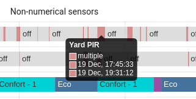
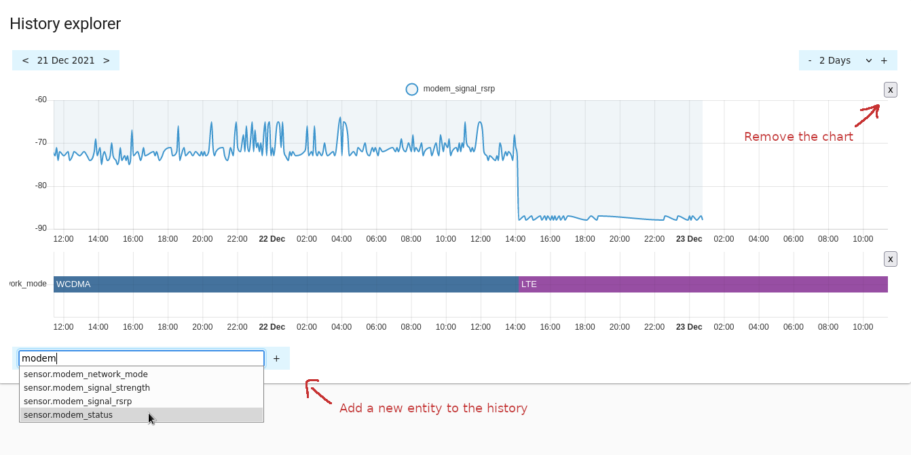

# History explorer card

This is a custom history card for Home Assistant. This card offers a highly interactive and configurable way to view the history of your entities in HA. The card uses asynchronous stream caching and adaptive data decimation to hide the high latency of HA's history database accesses and tries to make it into a smooth interactive experience.


## Usage

The history explorer card can be configured interactively through the UI or manually through YAML. The card can contain one or multiple charts, every chart can display the history of one or multiple entities. Currently the card supports line charts for numerical entities and timeline charts for non-numerical ones. The order the charts are displayed in the history, as well as the colors used for charts and timeline states are all fully configurable. 

https://user-images.githubusercontent.com/60828821/147440026-13a5ba52-dc43-4ff7-a944-9c2784e4a2f7.mp4

When the card is opened, it will display the history of the configured entities for the last 24 hours starting at the current date and time. On the top left you will find the date selector previous and next buttons, use them to quickly browse through the days. Your can use the right side time range selector (dropdown or plus / minus buttons) to zoom into or out of the history. You can also use the interactive zoom mode (magnifying glass icon) to select a region on a graph to zoom into.

Click or tap on a graph and drag left or right to slide it through time. The card will stream in the database as you move along. If you have a slow DB (like on an SD card), you may see empty parts on the chart that will progressively fill as the data comes in. The larger the shown time range, the more the effect is visible. So scrolling through entire weeks will generate more database accesses than scrolling through days or hours at a time, especially on slower CPUs, like phones.

Once you release the mouse button after dragging (or release your finger from the chart), the card will automatically readjust the y axes on all charts to better reflect the new data. The card will also synchronize all other charts in the history to the same point in time. That way you will always see the same time range on all your data and everything will be aligned.

Like in the native HA history panel, you can hover over the chart line or state timelines to get a tooltip of the selected values or state.

### Data decimation

The card will automatically reduce the data shown in the charts and remove details that would not be visible or useful at a given time range. For example, if you view a per-hour history, nothing will be removed and you will be able to explore the raw data, point by point. If you view an entire week at once, there's no need to show data that changed every few seconds, you couldn't even see it. The card will simplify the curves and make the experience a lot faster that way. 

This feature can be turned off in the options if you want, either globally or by entity.


Decimation works on state timelines by merging very small state changes into 'multiple' sections when they can't be seen individually anymore. Zoom into the timeline and the details will appear. The color used for the multiple sections can be adjusted per graph.



## Install and configuration

Only manual install is supported right now: 

 1. Download the history-explorer-card.js file and copy it into your config/www folder
 2. Add a resource reference to it. On the HA UI, navigate to Configuration -> Dashboards -> Resources. Visit the [Registering resources](https://developers.home-assistant.io/docs/frontend/custom-ui/registering-resources) page on the Home Assistant support site for more information.
 3. Click on the + Add Resource button
 4. Add /local/history-explorer-card.js into the URL field and make sure the resource type field says Javascript Module
 5. Hit create

You can now add the card to your dashboard as usual.

### Interactive configuration

The entities visible on the history explorer card can be defined in the card configuration or they can be added or removed on the fly through the card UI without changing the configuration. Both modes can be combined. The entities defined in the YAML will be displayed first and will always be visible when the dashboard is opened. Dynamically added entities will be displayed next. The entities you add or remove over the UI are remembered in your browsers local storage, so you don't to add them every time you reopen the HA page.

You can manage your dynamically configured entities like this:



If you want to manage all your entities dynamically, you will need to supply an empty YAML. You can still add global configuration settings.

```yaml
type: custom:history-explorer-card
graphs:
```

### Customizing state colors

The default colors used for the states shown on timeline graphs can be customized in many different ways. Customizing is done by adding the statesColor key to the card YAML. Colors act on device classes, domains or global states. You can, for example, have distinct colors for the on and off states of your motion sensors and your door sensors, even if they're both binary sensors.

The following example will turn the *on* state of all door sensors blue and the *on* state of all motion sensors yellow. The *on* state of other sensor device classes will not be affected. They will inherit their colors from either a domain wide or a global color rule, in that order (see below). You specify the device class followed by a dot and the state you'd like to customize:

```yaml
type: custom:history-explorer-card
stateColors:
  door.on: blue
  motion.on: yellow
```

You can also specify state colors for an entire domain. The following example will turn the *off* state for all binary sensors that don't have a color defined for their device class purple and the *home* state of the person domain green:

```yaml
type: custom:history-explorer-card
stateColors:
  binary_sensor.off: purple
  person.home: 'rgb(0,255,0)'
```

Finally, you can color a specific state globally through all device classes and domains. This can be used as a generic fallback. The following example colors the *off* state of all sensors red, as long as they don't have a specific rule for their device class or domain:

```yaml
type: custom:history-explorer-card
stateColors:
  off: '#ff0000'
```

There is a special virtual state that is added to all entities, the *multiple* state. This state substitutes an aggregation of multiple states on the timeline when they were merged due to data decimation. Like normal states, you can specify the color for this special state for device classes, domains or globally.

### Themes and dark mode

The card will try to adapt its UI colors to the currently active theme. But for best results, it will have to know if you're running a dark or a light theme. By default the card asks HA for this information. If you're using the default Lovelace theme, or another modern theme that properly sets the dark mode flag, then you should be all with the default settings. If you are using an older theme that uses the legacy format and doesn't properly set the dark mode flag, the card may end up in the wrong mode. You can override the mode by adding this YAML to the global card settings (see below) to force either dark or light mode:

```yaml
type: custom:history-explorer-card
uimode: dark
```
Replace dark with light to force light mode instead.
 
### YAML configuration

YAML configuration is optional. And while the interactive configuration is preferrable, it can sometimes be useful to keep a set of predefined entities.

Here's a basic example configuration:

```yaml
type: custom:history-explorer-card
graphs:
  - type: line
    entities:
      - entity: sensor.outside_temperature
        color: '#3e95cd'
        fill: rgba(151,187,205,0.15)
      - entity: sensor.annexe_temperature
        color: '#ee3452'
        fill: rgba(0,0,0,0)
  - type: line
    entities:
      - entity: sensor.outside_pressure
        color: '#3ecd95'
        fill: rgba(151,205,187,0.15)
  - type: timeline
    title: Non-numerical sensors
    entities:
      - entity: binary_sensor.pir_yard
        name: Yard PIR
      - entity: binary_sensor.door_barn
        name: Barn door
      - entity: input_select.qubino2_3
        name: Heater
      - entity: person.alex

```

And a more advanced one:

```yaml
type: custom:history-explorer-card
uimode: dark
stateColors:
  person.home: blue
  person.not_home: yellow
decimation: false
header: 'My sample history'
graphs:
  - type: line
    entities:
      - entity: sensor.outside_temperature
        color: '#3e95cd'
        fill: rgba(151,187,205,0.15)
        width: 4
        stepped: true
      - entity: sensor.annexe_temperature
        color: '#ee3452'
        fill: rgba(0,0,0,0)
        stepped: false
  - type: line
    entities:
      - entity: sensor.outside_pressure
        color: '#3ecd95'
        fill: rgba(151,205,187,0.15)
  - type: timeline
    title: Non-numerical sensors
    entities:
      - entity: binary_sensor.pir_yard
        name: Yard PIR
      - entity: binary_sensor.door_barn
        name: Barn door
      - entity: input_select.qubino2_3
        name: Heater

```

Replace the entities and structure as needed.
