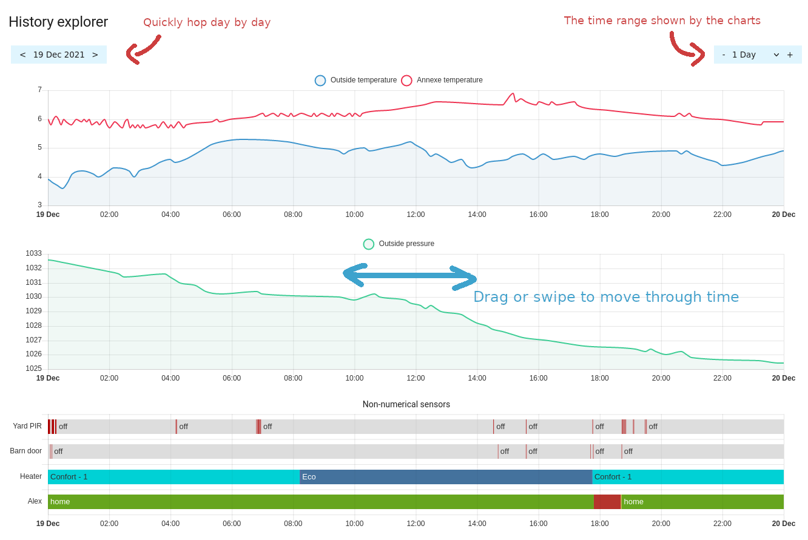
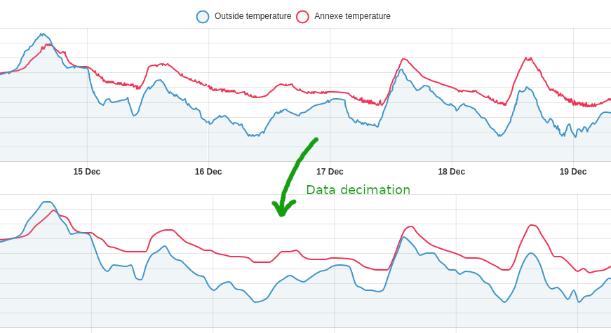

# History explorer card

This is a custom history card for Home Assistant. This card offers a highly interactive and configurable way to view the history of your entities in HA. This is a first early development release and basically a proof of concept. The card uses asynchronous stream caching and adaptive data decimation to hide the high latency of HA's history database accesses and tries to make it into a smooth interactive experience.

Expect a lot of bugs and issues at this time :)

## Usage

Right now, the card can only be manually configured in YAML. The card can contain one or multiple charts, every chart can display the history of one or multiple entities. Currently the card supports line charts for numerical entities and timeline charts for non-numerical ones. The order the charts are displayed in the history, as well as the colors used for charts and timeline states are all fully configurable. 



When the card is opened, it will display the history of the configured entities for the last 24 hours starting at the current date and time. On the top left you will find the date selector previous and next buttons, use them to quickly browse through the days. Your can use the right side time range selector (dropdown or plus / minus buttons) to zoom into or out of the history. Click or tap on a graph and drag left or right to slide it through time. The card will stream in the database as you move along. If you have a slow DB (like on an SD card), you may see empty parts on the chart that will progressively fill as the data comes in. The larger the shown time range, the more the effect is visible. So scrolling through entire weeks will generate more database accesses than scrolling through days or hours at a time, especially on slower CPUs, like phones.

Once you release the mouse button after dragging (or release your finger from the chart), the card will automatically readjust the y axes on all charts to better reflect the new data. This can generate a quick visual jump in the charts. I will have to find a way to mitigate this visually annoying effect. The card will also synchronize all other charts in the history to the same point in time. That way you will always see the same time range on all your data and everything will be aligned.

Like in the native HA history panel, you can hover over the chart line or state timelines to get a tooltip of the selected values or state.

### Data decimation

The card will automatically reduce the data shown in the charts and remove details that would not be visible or useful at a given time range. For example, if you view a per-hour history, nothing will be removed and you will be able to explore the raw data, point by point. If you view an entire week at once, there's no need to show data that changed every few seconds, you couldn't even see it. The card will simplify the curves and make the experience a lot faster that way. 

This feature can be turned off in the options if you want, either globally or by entity.



Decimation works on state timelines by merging very small state changes into 'multiple' sections when they can't be seen individually anymore. Zoom into the timeline and the details will appear. The color used for the multiple sections can be adjusted per graph.


## Install and configuration

Only manual install is supported right now: 

 1. Download the history-explorer-card.js file and copy it into your config/www folder
 2. Add a resource reference to it. On the HA UI, navigate to Configuration -> Dashboards -> Resources
 3. Click on the + Add Resource button
 4. Add /local/history-explorer-card.js into the URL field and make sure the resource type field says Javascript Module
 5. Hit create

You can now add the card to your dashboard as usual.

### Interactive configuration

The entities visible on the history explorer card can be defined in the card configuration or they can be added or removed on the fly through the card UI without changing the configuration. Both modes can be combined. The entities defined in the YAML will be displayed first and will always be visible when the dashboard is opened. Dynamically added entities will be displayed next. You can manage your dynamically configured entities like this:


If you want to manage all your entities dynamically, you will need to supply an empty YAML. You can still add global configuration settings.

```yaml
type: custom:history-explorer-card
graphs:
```

### YAML configuration

Here's a basic example configuration:

```yaml
type: custom:history-explorer-card
graphs:
  - type: line
    entities:
      - entity: sensor.outside_temperature
        color: '#3e95cd'
        fill: rgba(151,187,205,0.15)
      - entity: sensor.annexe_temperature
        color: '#ee3452'
        fill: rgba(0,0,0,0)
  - type: line
    entities:
      - entity: sensor.outside_pressure
        color: '#3ecd95'
        fill: rgba(151,205,187,0.15)
  - type: timeline
    title: Non-numerical sensors
    entities:
      - entity: binary_sensor.pir_yard
        name: Yard PIR
      - entity: binary_sensor.door_barn
        name: Barn door
      - entity: input_select.qubino2_3
        name: Heater
      - entity: person.alex

```

And a more advanced one:

```yaml
type: custom:history-explorer-card
stateColors: '{ "on": "#b00000", "off": "#dddddd", "home": "#ff3333", "not_home": "#0000aa" }'
decimation: false
header: 'My sample history'
graphs:
  - type: line
    entities:
      - entity: sensor.outside_temperature
        color: '#3e95cd'
        fill: rgba(151,187,205,0.15)
        width: 4
        stepped: true
      - entity: sensor.annexe_temperature
        color: '#ee3452'
        fill: rgba(0,0,0,0)
        stepped: false
  - type: line
    entities:
      - entity: sensor.outside_pressure
        color: '#3ecd95'
        fill: rgba(151,205,187,0.15)
  - type: timeline
    title: Non-numerical sensors
    entities:
      - entity: binary_sensor.pir_yard
        name: Yard PIR
      - entity: binary_sensor.door_barn
        name: Barn door
      - entity: input_select.qubino2_3
        name: Heater

```

Replace the entities and structure as needed.
